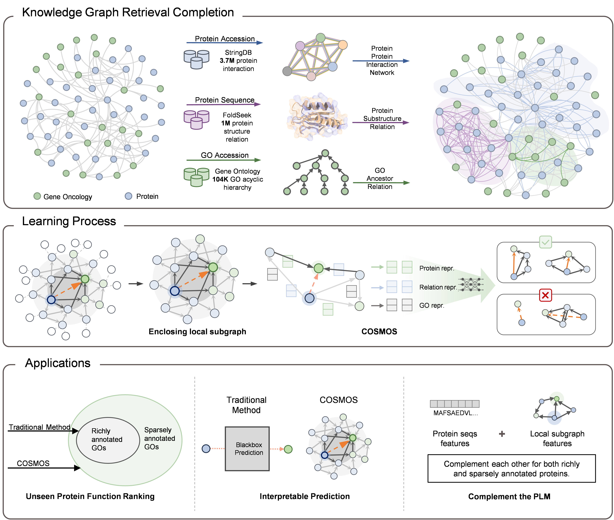

#	COSMOS



This repository contains scripts for creating and training COSMOS models, as well as scripts for evaluating model performance.

## Environment setup

While in the project directory run

```
git clone https:
cd cosmos
conda env create -f environment.yml
conda activate cosmos
```

Or you may setup the enviroment step by step

```
conda create -n cosmos python=3.10
```

activate the enviroment

``` 
conda activate cosmos
```

Installation

```
conda install pytorch torchvision torchaudio pytorch-cuda=11.7 -c pytorch -c nvidia
conda install -c conda-forge rdkit
conda install dgl==0.4.2
pip install requirements.txt
```


## Run COSMOS model

### Checkpoint downloads

Download and unzip the **[COSMOS models](https://drive.google.com/file/d/1ELQ4noOoSb00D7Ub8QYrRCgk_W-TPN0e/view?usp=drive)** containing the model checkpoint.

Follow these instructions to obtain predictions for your proteins. 

- Download the (inference dataset)

- Extract the inference dataset

- Run the corresponding model 

  `python inference.py -d bp_zeroshot_test -e bp_zeroshot --runs 3`

  

## Data preparation

We have conducted retrieval completion on the basis of [ProteinKG25](https://zjunlp.github.io/project/ProteinKG25/) and have presented our **[COSMOS dataset](https://drive.google.com/drive/folders/1y-1kSvIauFFCQP5edYPWGscljZHcEfe9)** to download our prepared data, 2) generate your own dataset.

For generating your own pre-training data, you need download following raw data:

- `go.obo`: the structure data of Gene Ontology. The download link and detailed format see in [Gene Ontology](http://geneontology.org/docs/download-ontology/)`
- `uniprot_sprot.dat`: protein [Swiss-Prot](https://www.uniprot.org/downloads) database.
- `goa_uniprot_all.gaf`: [Gene Annotation](https://ftp.ebi.ac.uk/pub/databases/GO/goa/old/UNIPROT/) data.

When download these raw data, you can execute following script to generate pre-training data:

```
python tools/gen_onto_protein_data.py
```

1. For retrieval completion, you need to find relevant protein relations through [StringDB](https://stringdb-downloads.org/download/protein.links.v12.0.txt.gz) and [FoldSeek]([Foldseek Search Server](https://search.foldseek.com/search)), and the eligible protein relations are in the [COSMOS dataset](https://drive.google.com/drive/folders/1y-1kSvIauFFCQP5edYPWGscljZHcEfe9)

2. For the relation above, extract the topK relation for the given protein/GO

   

## Training the models

To train the models and reproduce our results, you can directly download the dataset we provide or generate the dataset yourself.

- Download the COSMOS dataset

- generating the dataset

  - zero-shot dataset

    ```python utils/prepare_meta_data.py -nd cosmos -n 5000 -t GO -sl bp_zeroshot.txt -s 3```

  - few-shot dataset

    ```python utils/prepare_meta_data.py -nd cosmos-n 5000 -t GO -sl bp_fewshot.txt -s 3```

- Training example:

  - Train a single COSMOS BP prediction model which 
    `python train.py -d bp_zeroshot -e bp_zeroshot`

    ```
    python train.py \
        --experiment_name "experiment" 
        --dataset "dataset"
        --gpu 0 \
        --disable_cuda \
        --load_model \
        --num_epochs 100 -ne 100 \
        --eval_every 3 \
        --early_stop 200 \
        --lr 0.01 \
        --clip 1000 \
        --margin 10 \
        --hop 3 \
        --max_nodes_per_hop 256 -max_h 256 \
        --batch_size 128 \
        --num_neg_samples_per_link 1 -neg 1 \
        --num_workers 8 \
        --edge_dropout 0.5 \
        --add_ht_emb -ht \
        --has_attn -attn
    ```
    
    
    

## Evaluating the predictions

The training scripts generate predictions for the test data that are used to compute evaluation metrics.

- To evaluate predictions run test_auc_complement.py script. Example:
  `python inference.py -d bp_zeroshot_test -e bp_zeroshot --runs 3`
- To evaluate ranking use test_ranking.py script. Example:
  `python test_ranking.py -d bp_zeroshot_test -e bp_zeroshot `


## Reference


